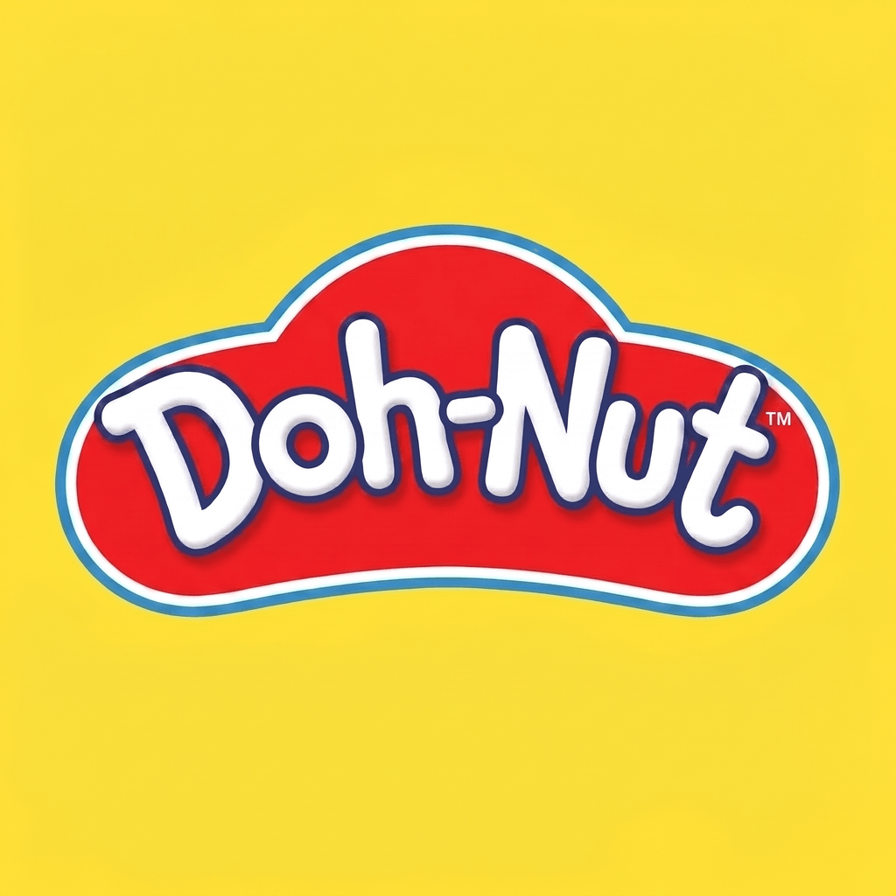
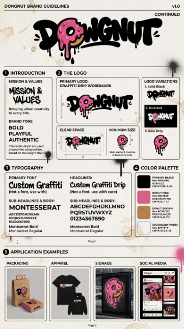
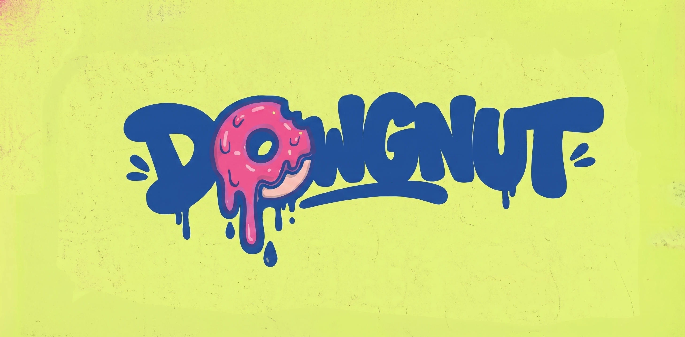

# 🍩 DOHNUT — Malaysian Donut Drop, Hot Out The Fryer 🔥

> **Graffiti, glazed, and unapologetically local.** A mobile-first donut delivery app with a hypebeast shell, Malaysian soul, and zero BS.



---

## 🛎️ What Is This?

**DOHNUT** is a Next.js 16 + React 19 single-page donut shop that feels like a sneaker drop. Browse **31 curated flavors** (8 Classics + 6 Sprinkled + 8 Stuffed + 6 Malaysian Specialties + 3 Savory / Sira Series), swipe-deck your way to a craving, drop into a glassmorphic cart, and pay with **Billplz** (FPX / TnG / DuitNow QR). Live order tracking. AI Concierge. Optional signup that actually saves you time. **SST 6%** handled. **Free delivery over RM25.** RM3.99 flat below.

The whole thing deploys to **Vercel in one click** and ships with a real-time tracking mini-service you can host separately when you need WebSocket magic.

---

## ✨ Features — The Full Roll Call

| Feature | Icon | Where It Lives | Notes |
|---|---|---|---|
| 🛒 **Glassmorphic cart drawer** | `bg-lime/30` when free delivery unlocks | `src/components/dohnut/cart-drawer.tsx` | Drag handle, hover-shrink remove, dashed-border total |
| 🍩 **31-donut catalog** | 8 Classic + 6 Sprinkled + 8 Stuffed + 6 Malaysian + 3 Savory | `src/lib/seed-data.ts` | Auto-seeded on Vercel cold start (100% unique 1024x1024 assets) |
| 💳 **Billplz payments** | FPX, TnG, DuitNow QR | `src/app/api/payment/billplz/*` | HMAC-SHA256 webhook, dev fallback when unconfigured |
| 📍 **Live order tracking** | WebSocket + REST polling fallback | `mini-services/order-tracking/` | Deploy separately (Render / Railway / Fly.io) |
| 🤖 **AI Concierge** | Floating FAB, safe-area aware | `src/components/dohnut/ai-concierge.tsx` | `/api/ai/concierge` — DOH BOY™ persona & rate-limited |
| 🎨 **AI Designer** | Generate donut illustrations | `src/components/dohnut/ai-designer.tsx` | `/api/ai/designer` — Visual DNA & rate-limited |
| 👤 **Optional customer profile** | Auto-creates on first checkout | `src/store/use-shop.ts` | Saved addresses, recently viewed, Zustand-persisted |
| ❤️ **Favorites** | One-tap save | `src/app/api/favorites/*` | Persisted per session |
| 📜 **Order history** | Live tracking + receipts | `src/components/dohnut/orders-view.tsx` | Bottom-nav "Orders" tab |
| 🖱️ **Swipe deck** | "Pick your poison" card stack | `src/components/dohnut/swipe-view.tsx` | Keyboard nav ←/→/Enter/Space |
| 🔎 **Search + filter** | All / Classic / Sprinkled / Stuffed / Specialty / Savory | `src/components/dohnut/shop-home.tsx` | Vertical grid, not a carousel |
| 🌗 **Light / Dark themes** | Official brand tokens | `src/app/globals.css` | Yellow `#FDE047`, Red `#EF233C`, Navy `#1D3557` |
| ♿ **WCAG AA contrast** | Focus-visible 2px outline + 3px offset | `src/app/globals.css` | `--muted-foreground` calibrated for accessibility |
| 📱 **PWA-ready splash** | 1.6s entrance, respects `prefers-reduced-motion` | `src/components/dohnut/splash-screen.tsx` | sessionStorage guarded |
| 🛡️ **Admin dashboard** | Order overview, KPIs | `src/components/dohnut/admin-dashboard.tsx` | Guarded by `ADMIN_API_KEY` |
| 💾 **Auto-reseed** | Schema + 31 donuts on cold start | `src/lib/ensure-ready.ts` | Vercel `/tmp` ephemeral SQLite |

---

## 🇲🇾 31-Flavor Catalog Breakdown

Every donut features a 100% unique, high-resolution photo-realistic asset:

### 🌿 Malaysian Specialties (6 Flavors)
| Donut | Vibe & Ingredients | Tags |
|---|---|---|
| **Pandan Gula Melaka** | Fragrant pandan leaves + caramelized palm sugar drizzle | `specialty`, `malaysian` |
| **Teh Tarik Kaw Glaze** | Pulled milk-tea foam glaze over fluffy yeast shell | `specialty`, `malaysian` |
| **Musang King Durian Bomb** | Filled with real Musang King golden pulp lava | `specialty`, `malaysian`, `stuffed` |
| **Cameron Strawberry Drip** | Cameron Highlands strawberry puree & ruby drizzle | `specialty`, `malaysian` |
| **Ipoh White Coffee Glaze** | Roasted Ipoh coffee beans infused into silky glaze | `specialty`, `malaysian` |
| **Teh Tarik Classic Foam** | Light black tea glaze with frothy condensed milk foam | `specialty`, `malaysian` |

### 🧂 Savory / Sira Series (3 Flavors)
| Donut | Vibe & Ingredients | Tags |
|---|---|---|
| **Kuih Burger Malaysia** | Sliced donut bun, sweet-spicy sambal bilis, cucumber & crispy ikan bilis | `savory`, `malaysian` |
| **Sira Kuih Keria** | Sweet potato dough donut coated with crackly crystallized Gula Melaka | `savory`, `malaysian` |
| **Sira Sambal** | Glossy lacquered spicy sambal sira glaze topped with toasted sesame seeds | `savory`, `malaysian` |

### 🍩 Classics & Favourites (22 Flavors)
- **Classic (8)**: Classic Glazed, Chocolate Cake Classic, Maple Glaze Ring, Powdered Sugar Donut, Cinnamon Sugar Twist, Old-Fashioned Sour Cream, Toasted Coconut Glaze, Hainanese Kopi-O Glaze.
- **Sprinkled (6)**: Rainbow Birthday Sprinkle, Chocolate Sprinkle Bomb, Strawberry Funfetti, Vanilla Bean Jimmie, Confetti Fiesta Sparkle, Matcha White Choco Sprinkle.
- **Stuffed (8)**: Boston Cream Bomb, Raspberry Jelly Burst, Cookies & Cream Core, Lemon Curd Pocket, Salted Caramel Cloud, Nutella Hazelnut Lava, Blueberry Cheesecake Fill, Strawberries & Cream Stuffed.

---

## 🧰 Tech Stack

| Layer | What | Why |
|---|---|---|
| **Framework** | Next.js 16 (App Router, webpack, standalone build) | SPA feel with API routes co-located |
| **UI** | React 19 + Tailwind v4 + shadcn/ui (Radix) | Type-safe, accessible, theme-able |
| **Motion** | Framer Motion 12 | Snappy springs, gesture-aware |
| **State** | Zustand 5 (`persist` middleware) | Light, no Redux ceremony |
| **DB** | Prisma 6 + SQLite (Postgres-ready) | One-click Vercel deploy |
| **Real-time** | Bun + socket.io mini-service | Optional, deploy separately |
| **AI** | In-house `/api/ai/*` (Z.ai SDK) | No CopilotKit, no per-token SaaS bill |
| **Payments** | Billplz REST v3 + HMAC-SHA256 | Malaysian-native, FPX / TnG / DuitNow |
| **Validation** | Zod 4 | Runtime safety on every API boundary |
| **Types** | TypeScript 5 (strict) | Because shipping types > shipping regrets |
| **Fonts** | Lilita One (display) + Geist Sans + Geist Mono (via `next/font/google`) | Graffiti display + clean body + mono numerals |

---

## 🚀 Quick Start

```bash
# 1. Install
bun install                # or: npm install / pnpm install / yarn

# 2. Set up DB (SQLite default)
bun run db:push            # create schema
bun run seed               # seed 31 donuts

# 3. Run dev server
bun run dev                # http://localhost:3000

# 4. (Optional) Real-time tracking
cd mini-services/order-tracking
bun install
bun run dev                # port 3004
```

That's it. No `.env` file required for first boot — the dev fallback kicks in for Billplz and the app runs end-to-end with instant-paid dev orders.

---

## 🛍️ Customer Journey

1. **Splash** → Brand wordmark + mascot, 1.6s, sessionStorage-suppressed on revisits
2. **Shop Home** → Vertical grid of all donuts, search bar, filter chips (All / Classic / Sprinkled / Stuffed / Specialty / Savory)
3. **Swipe Deck** → Card-stack mode for "I don't know what I want, just feed me"
4. **Detail Modal** → Full donut info, reviews, "Add to Cart"
5. **Cart Drawer** → Glassmorphic, drag-handle, free-delivery progress bar
6. **Checkout** → Name, phone, address, payment method (FPX / TnG / DuitNow QR / Cash on Delivery), SST 6% line
7. **Billplz Redirect** → Hosted payment page (sandbox or production)
8. **Live Tracking** → Order progresses: Received → Preparing → Baking → Out for Delivery → Delivered (real-time via WebSocket, polling fallback)
9. **Orders Tab** → Re-order anything from history

> **Optional signup**: We auto-create a `CustomerProfile` on your first checkout (name + phone + default address). You don't need an account to order. Profile unlocks saved addresses, faster checkout, and recently-viewed donut memory.

---

## 💳 Billplz Setup

### Sandbox (dev, no creds)
Just leave the Billplz env vars unset. Checkout hits the dev fallback → order marked paid immediately → straight to live tracking screen. Perfect for demos.

### Production
1. Sign up at **https://www.billplz.com** → create a Collection.
2. Add to `.env.local` (or Vercel env vars):

```bash
BILLPLZ_API_KEY=your_api_key
BILLPLZ_COLLECTION_ID=your_collection_id
BILLPLZ_X_SIGNATURE_KEY=your_webhook_signing_key
BILLPLZ_SANDBOX=false
```

3. Point the webhook at `https://<your-domain>/api/payment/billplz/webhook` in Billplz Dashboard → Webhooks. The route verifies `X-Signature` (HMAC-SHA256, timing-safe) and rejects anything that doesn't match.
4. SST 6% is auto-computed in `POST /api/orders`. Free delivery threshold: RM25. Below: RM3.99 flat.

See [VERCEL_DEPLOY.md](./VERCEL_DEPLOY.md) for the full deployment + env-var reference.

---

## 🌐 Deploy to Vercel

Two flavors:

| Option | Database | Cart persistence | Effort |
|---|---|---|---|
| **A. Demo** | SQLite on `/tmp` (ephemeral) | Resets on cold start | One-click |
| **B. Production** | Vercel Postgres / Neon / Supabase | Survives cold starts | 10 min setup |

Full walkthrough: **[VERCEL_DEPLOY.md](./VERCEL_DEPLOY.md)**.

---

## 🗂️ Project Map

```
src/
├── app/
│   ├── page.tsx                      # Main SPA — all views orchestrated here
│   ├── layout.tsx                    # Lilita One + Geist fonts, error boundary, SW register
│   ├── globals.css                   # Brand tokens, focus rings, glass utilities
│   └── api/
│       ├── donuts/                   # Catalog CRUD
│       ├── cart/                     # Per-session cart
│       ├── favorites/                # Wishlist
│       ├── orders/                   # Checkout + tracking
│       ├── payment/billplz/          # create + webhook
│       ├── ai/concierge/             # AI flavor match
│       ├── ai/designer/              # AI illustration
│       └── admin/stats/              # Dashboard KPIs
├── components/dohnut/               # All branded components
├── lib/
│   ├── seed-data.ts                  # 31-donut catalog
│   ├── ensure-ready.ts               # Auto-reseed on cold start
│   ├── billplz.ts                    # Billplz client + HMAC verify
│   ├── types.ts                      # Shared TypeScript types
│   └── serialize.ts                  # Decimal-safe Prisma serializers
└── store/use-shop.ts                 # Zustand: cart, profile, favorites

prisma/
├── schema.prisma                     # SQLite default, Postgres-ready
└── seed.ts                           # bun run seed

mini-services/order-tracking/         # Optional WebSocket host

public/
├── brand/                            # Logo, mascot, hero banners, donut photos
└── ...
```

---

## 📸 Screenshots

| | |
|---|---|
|  |  |
|  |  |
|  |  |

> Brand assets live under `public/brand/`. Donut photography is photo-realistic (per spec), not AI-generated — consistent 1024x1024 framing across all 31 SKUs.

---

## 🔐 Security Notes

- `ADMIN_API_KEY` is required in production for `/api/admin/*` and `/api/orders/[id]/status`. The dev guard was a known leak point; **rotated and now enforced**.
- `.env` is gitignored. Never commit API keys.
- Billplz webhook uses **HMAC-SHA256 with constant-time comparison** — no signature, no access.
- Session isolation: cart/orders/favorites are scoped by `x-session-id` header (lightweight per-device binding, not full auth).

All critical and high-severity items from the internal security audit (now archived, Aug 2026) have been remediated.

---

## 🤝 Contributing

This is a showpiece / commercial-leaning project. If you're forking:

1. **Don't change the concept.** Brand colors, Lilita One display type, glassmorphism, motion language — these are sacred.
2. Respect the `src/lib/seed-data.ts` shape (`sugar`, `fat`, `calories`, `tags[]` are all expected by the UI).
3. If you add a new flavor, add it to the seed (the UI auto-cycles real photos for any donut in the catalog).
4. Test Billplz with `BILLPLZ_SANDBOX=true` before flipping to production keys.

---

## 📝 License

Private / All Rights Reserved. Contact the maintainer for licensing inquiries.

---

## 🍩 Built With

- Next.js · React · TypeScript · Tailwind v4 · shadcn/ui
- Prisma · SQLite (Postgres-ready) · Zustand · Framer Motion
- Billplz · socket.io · Bun
- Lilita One + Geist

---

> **DOHNUT** — *GOOD VIBE. GOOD DOH.*

## 📋 Audit & Revision Ledger (SMS-v1.0)
| Version | Timestamp (MYT) | Author | Why (Intent / Trigger) | How (Modifications & Touched Areas) | Validation Proof |
| :--- | :--- | :--- | :--- | :--- | :--- |
| `1.2.0` | 2026-09-05 09:30:00 | Sovereign Conductor | Alignment semua dokumen projek (.md) | Tambah SMS-v1.0 frontmatter & ledger; perbetul 31 SKU katalog, path logo rasmi | `bun run build`: 13/13 pages OK |
| `1.1.0` | 2026-09-02 18:00:00 | Hermes Agent | Rebrand visual & palette | Kemaskini tema kuning/merah/navy dan DOH Language | Browser DOM verified |
| `1.0.0` | 2026-08-25 12:00:00 | Core Team | Dokumentasi awal projek | Release v1.0 storefront Next.js | Initial release |
